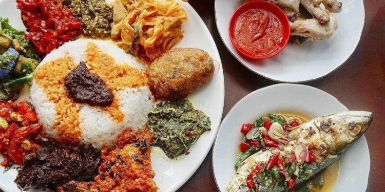

# Kuliner Indonesia
Sangat enak
<!DOCTYPE html PUBLIC "-//W3C//DTD XHTML 1.0 Transitional//EN" "http://www.w3.org/TR/xhtml1/DTD/xhtml1-transitional.dtd">
<html xmlns="http://www.w3.org/1999/xhtml">
<head>
<meta http-equiv="Content-Type" content="text/html; charset=utf-8" />
<!--
.style1 {	font-size: 36px;
	font-weight: bold;
	font-family: Tahoma;
}
.style3 {color: #FFFFFF}
.style4 {font-size: smaller}
.style2 {font-size: x-large
}
-->
</style>
</head>

<body>
<table width="822" height="497" border="1">
  <tr>
    <td colspan="5">
Kuliner Indonesia
</td>
  </tr>
  <tr>
    <td width="308" height="28" align="center" bgcolor="#FF0033">
<a href="Home.html">Ayam Goreng</a>
</td>
    <td width="136">
<a href="Martabak.html">Martabak</a>
</td>
    <td width="88">
Tahu
</td>
    <td width="94">
Tempe
</td>
    <td width="162">
Ikan Goreng
</td>
  </tr>
  <tr>
    <td colspan="5" valign="top">

      
    
</td>
  </tr>
</table>
</body>
</html>
